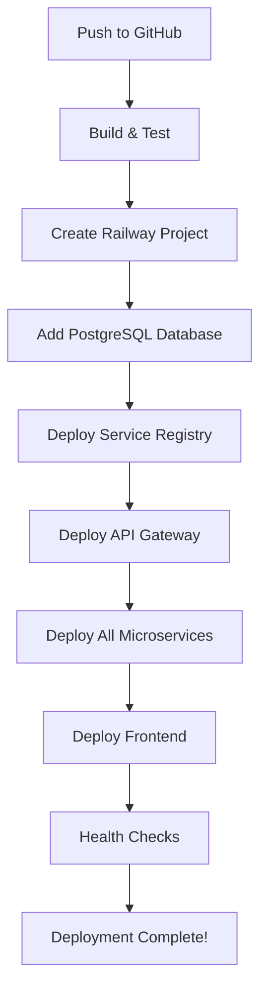

# 🤖 Fully Automated Deployment Guide

## 🎯 One-Time Setup (5 minutes)

This guide will set up **fully automated deployment** - just push to GitHub and everything deploys automatically!

### Step 1: Add GitHub Secrets

Go to your GitHub repository → Settings → Secrets and variables → Actions

Add these secrets:

```
RAILWAY_TOKEN=your-railway-token
VERCEL_TOKEN=your-vercel-token
VERCEL_FRONTEND_URL=your-app-name
```

### Step 2: Get Railway Token
1. Go to [Railway Dashboard](https://railway.app)
2. Click your profile → Account → Tokens
3. Create new token named "GitHub Actions"
4. Copy the token

### Step 3: Get Vercel Token
1. Go to [Vercel Account Tokens](https://vercel.com/account/tokens)
2. Create new token named "MediSlot Deployment"
3. Copy the token

### Step 4: Choose Frontend URL
Decide on your Vercel app name (e.g., `medislotapp`)

## 🚀 Automated Deployment Process

### What Happens Automatically:

1. **Build & Test**: All services are built and tested
2. **Create Railway Project**: New project "MediSlot-Backend" is created
3. **Add PostgreSQL Database**: Database service is automatically created
4. **Deploy Service Registry**: First service deployed
5. **Deploy API Gateway**: With automatic service linking
6. **Deploy All Microservices**: With automatic database linking
7. **Deploy Frontend**: To Vercel with correct API URL
8. **Health Checks**: Verify all services are running

### Service Linking (Automatic)
- Database credentials are automatically linked using `${{ Postgres.DATABASE_URL }}`
- No manual credential copying needed
- Railway handles all connection management

## 📋 Required GitHub Secrets

| Secret Name | Description | How to Get |
|-------------|-------------|------------|
| `RAILWAY_TOKEN` | Railway API token | Railway Dashboard → Account → Tokens |
| `VERCEL_TOKEN` | Vercel API token | Vercel Dashboard → Account → Tokens |
| `VERCEL_FRONTEND_URL` | Your app name | Choose any name (e.g., `medislotapp`) |

## 🔄 Deployment Flow



## 🎯 What You Get

### After First Deployment:
- ✅ **Frontend**: `https://your-app-name.vercel.app`
- ✅ **API Gateway**: `https://api-gateway-production-xxx.up.railway.app`
- ✅ **Service Registry**: `https://service-registry-production-xxx.up.railway.app`
- ✅ **Database**: Managed in Railway dashboard
- ✅ **All Microservices**: Deployed and connected

### Automatic Features:
- ✅ **Service Discovery**: All services register with Eureka
- ✅ **Database Linking**: Automatic connection strings
- ✅ **Health Monitoring**: Built-in health checks
- ✅ **SSL/HTTPS**: Automatic certificates
- ✅ **Scaling**: Railway handles scaling automatically

## 🚀 How to Deploy

### First Time Setup:
1. Add the 3 GitHub secrets above
2. Push your code to main branch
3. Watch the GitHub Actions workflow run
4. Get your live URLs from the workflow output

### Subsequent Deployments:
1. Make changes to your code
2. Push to main branch
3. Everything deploys automatically!

## 📊 Monitoring

### GitHub Actions:
- Go to Actions tab in your repository
- Watch real-time deployment progress
- See deployment logs and health checks

### Railway Dashboard:
- Monitor all backend services
- View database performance
- Check service logs

### Vercel Dashboard:
- Monitor frontend performance
- View analytics and errors

## 🔧 Troubleshooting

### Common Issues:

**Workflow Fails on Railway Token**
- Verify Railway token is correct
- Check token has proper permissions

**Workflow Fails on Vercel Token**
- Verify Vercel token is correct
- Check token has proper permissions

**Services Not Connecting**
- Check Railway dashboard for service status
- Verify environment variables are set correctly

**Database Connection Issues**
- Railway automatically handles database linking
- Check service logs for connection errors

## 🎉 Success!

Once the workflow completes successfully:

1. **Your app is live**: `https://your-app-name.vercel.app`
2. **All services running**: Check Railway dashboard
3. **Database connected**: Automatic linking working
4. **Health checks passing**: All systems operational

## 📈 Scaling

### Automatic Scaling:
- Railway handles database scaling
- Services scale based on demand
- Vercel handles frontend scaling

### Manual Scaling:
- Upgrade Railway plan for more resources
- Upgrade Vercel plan for more features

## 🔒 Security

### Built-in Security:
- ✅ No hardcoded credentials
- ✅ Automatic SSL certificates
- ✅ Railway-managed secrets
- ✅ Secure service-to-service communication

### Best Practices:
- ✅ Environment variables for all secrets
- ✅ Automatic credential rotation
- ✅ Secure database connections
- ✅ CORS properly configured

## 🎯 Benefits of Automated Deployment

| Aspect | Manual Deployment | Automated Deployment |
|--------|------------------|---------------------|
| **Setup Time** | 30+ minutes | 5 minutes |
| **Deployment Time** | 15+ minutes | 5 minutes |
| **Error-prone** | High (manual steps) | Low (automated) |
| **Maintenance** | Manual updates | Automatic |
| **Scaling** | Manual configuration | Automatic |
| **Monitoring** | Manual setup | Built-in |

## 🚀 Ready to Deploy!

**Total Setup Time**: 5 minutes  
**Deployment Time**: 5 minutes  
**Maintenance**: Zero (fully automated)  
**Cost**: $0/month 🆓

Just add the 3 GitHub secrets and push to main branch - everything else is automated! 